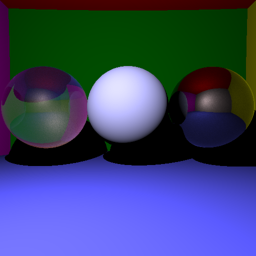
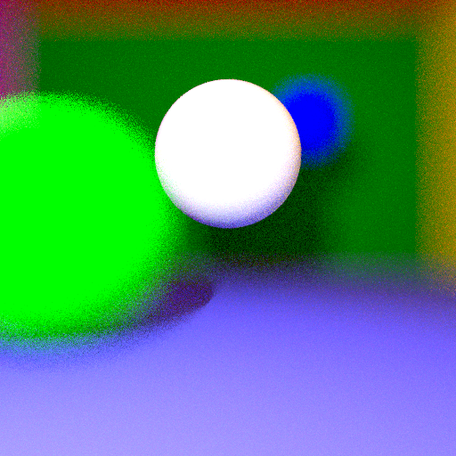

## Introduction

In this project, I used the `stb_image` and `stb_image_write` headers ([GitHub](https://github.com/nothings/stb)) to simulate a 3D scene using ray tracing in `C++`. Ray tracing is a rendering technique that generates images with a high degree of realism by modeling the path of light rays in a scene.

The scene will be composed of spheres. To create the walls, floor, and ceiling of the scene, spheres with very large radii will be used. Inside the scene, there will be a sphere representing the light source and other spheres acting as objects in the scene.

In the second phase, using triangular meshes, a cat will be modeled, and a texture will be applied to achieve a realistic rendering.

## Definitions

An image will be considered as a 2D array of pixels, with each pixel being an RGB triplet:


```
image[yW3 + x3 + 0] = red_value 
image[yW3 + x3 + 1] = green_value 
image[yW3 + x*3 + 2] = blue_value
```


A light ray will be defined by an origin vector `O` and a unit direction vector `u`:

```R = O + u * t |u| = 1```


The scene will be modeled as follows:


Computer screens do not respond linearly to the pixel intensities they receive. To compensate for this effect, gamma correction is applied to the images produced by our path tracer. This consists of raising the RGB values (in the normalized range [0, 1]) to the power of 1./γ, with γ typically being 2.2.

The number of bounces for a light ray is set to 5.

## Direct Lighting

First, we display a single sphere with center (-8,5,0), a radius of 10, and an albedo of (0.5, 0.5, 1):


## Mirror

Next, we add the mirror property. To do this, we add a `bool mirror` property to the `Sphere` class. In the `getColor` function, which calculates the color for an incoming ray, we add a condition. If the object has the mirror property set to true, we recursively call `getColor`, but with the intersection point as the new origin and the reflection of the ray as the new direction.


Note: Be cautious of numerical instability. We return `getColor` with a slight offset for the new ray's origin. In the following, we use an offset of `ε * ω_r`, with ε = 1e-3 and ω_r being the direction of the new ray.

## Refraction

To handle transparent spheres, we also add a refractive index `n` property to the sphere. If no refraction is desired, we set `n = 0` (the default value), otherwise, we can set `n = 1.5`, for example.


To create transparent but hollow spheres, we add a second sphere with a smaller radius inside the first one. We define a new `bool hollow` property for the sphere. In `getColor`, if `hollow` is true, we swap the two refractive indices. We set `hollow = true` for the smaller inner sphere.


## Fresnel

We add Fresnel coefficients for reflection. Instead of only transmitting a refracted ray, we add a reflected ray in addition to the transmission, with both rays weighted by the Fresnel reflection and transmission coefficients. To avoid multiple recursive calls to `getColor`, we return only a reflected ray with probability `R`, and a transmitted ray otherwise (with probability `T = 1 - R`).



Up until now, the light intensity was 5E9; from this point onward, it is set to 5E10.

## Indirect Lighting

For indirect lighting, we recursively call `getColor`, decreasing the number of bounces with each iteration. Simultaneously, we replace the point light source with a volumetric light source. It is integrated into the list of spheres, with a special case for `i = 0`, which corresponds to the light source.


From this point onward, Fresnel coefficients are disabled for faster computation.

## Motion Blur

For motion blur, we add a time factor to the rays. Then, in the intersection calculation, we shift the sphere by `velocity * time`. We also add a velocity to the sphere. The ray's time is chosen randomly between 0 and the parameter `MOTION_BLUR = 0.5`.


## Anti-Aliasing

For anti-aliasing, instead of sending rays towards the center of pixels, we send rays in a random direction around the center of the pixels. We use a spread of 0.33, which means 99% of the rays fall within the pixel's width (3σ and a Gaussian distribution).


## Depth of Field

For depth of field, we slightly shift the camera when sending rays. Objects in the focal plane always have the same intersection and appear sharp. Objects that are farther or closer appear blurred.



## Mesh

To render objects other than spheres, we create an abstract `Geometry` class so that all objects can be handled the same way by `getColor`. We use the provided function to load the mesh. We also create bounding boxes containing at least five triangles.


By using barycentric coordinates for the normals, we get a smoother cat model.


Finally, we add textures. To do this, we use the texture file provided with the cat model, "cat_diff.png".


